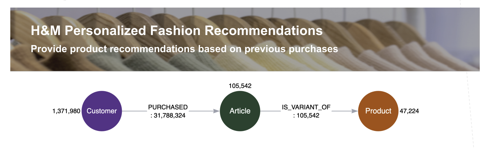

# __:warning: This Project is Inactive. Contents have been migrated to an updated repository__

__Goping forward please refer to [neo4j-product-examples/ds-spark-examples](https://github.com/neo4j-product-examples/ds-spark-examples/) for examples on using Spark and the Data Warehouse Connector with Neo4j. 
This specific example has been migrated to [neo4j-product-examples/ds-spark-examples/spark-databricks-delta-lake](https://github.com/neo4j-product-examples/ds-spark-examples/tree/main/spark-databricks-delta-lake)__

# Demo of Databricks Delta Lake Integration

1. `stage-delta-tables-from-csvs` creates the delta tables
2. `demo-etl` demonstrates ETL from Delta Lake into Neo4j

The source data used is from the [H&M Personalized Fashion Recommendations Kaggle Competition](https://www.kaggle.com/competitions/h-and-m-personalized-fashion-recommendations/data).

 
> **_NOTE:_**  Databricks automatically converts python notebooks (`.ipynb`) to `.py` files when committing to git. to convert the `.py` files back to notebooks see https://github.com/Yoyodyne-Data-Science/ipynb-py-convert-databricks 
